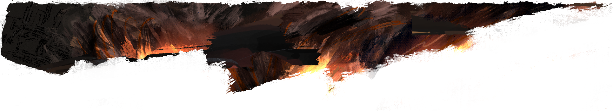

    

> ☎️ `hi, hello, hello;` ☎️ 👏 🙌👋

### My skills

1. __Programming__
    1. __Frontend__: `JS (ES5+)`
        1. Browser API: `XHR`, `Fetch`, `CORS`, `cache control`, `callback`, `promise`, `async`, `canvas`, `history`, `prototype override`, `fingerprint👁️`
        2. Frameworks: `knockout` (3.5+), `TKO`, `Angular` (11+)
    2. __Backend__
        1. Python (3.5+): `flask-*`, `tornado`, `fastAPI`, `SQLAlchemy`, `peewee`, `cProfile`, `PyGame`, `arcade`, `tkinter`
        2. Go (1.10+): `net/http`, `net/url`
2. Network Management: `cisco ASA`. `MikroTik`, `pfSence`, `openWRT`, `piHole`, `squid`, `ipSec`, `DMZ`, `wireguard`, `etherchannel`, `OSPF`, `BGP`, `EIGRP`, `DoH`, `DoT`
3. System Administration: `Windows Server 2016`, `Windows Server nano`,
`Active Directory`, `Apple MDM`, `Citrix MDM`, `FreeNAS`, `TrueNAS`, `Synapse`, `pfSense`, `openWRT`, `NextCloud`, `CEPH`, `unRAID`, `BTRFS`, `ZFS RAID`, `ThensorFlow`
    1. Virtualisation: `Hyper-V`, `Veeam`, `kvm/qemu`, `OpenStack: nova, cinder, neutron, keystone, horizon`, `coreOS`, `xen`, `GPU passthrough`

---

    

